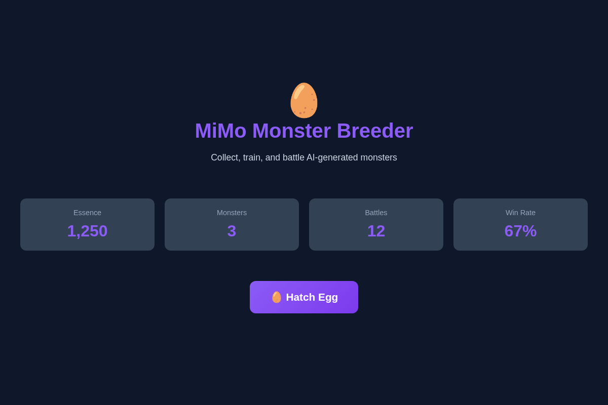
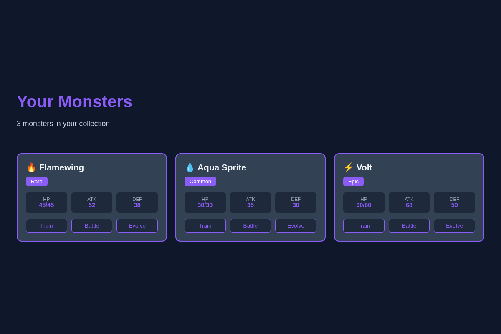
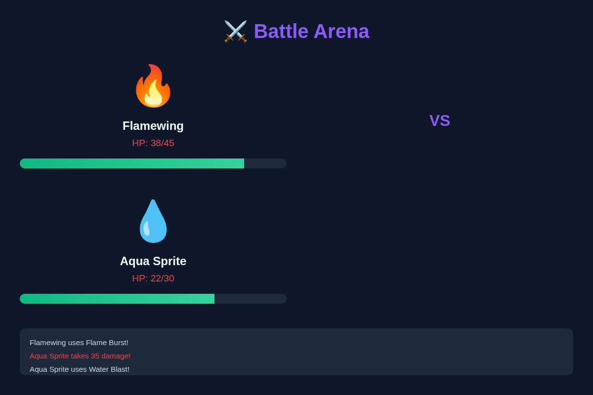
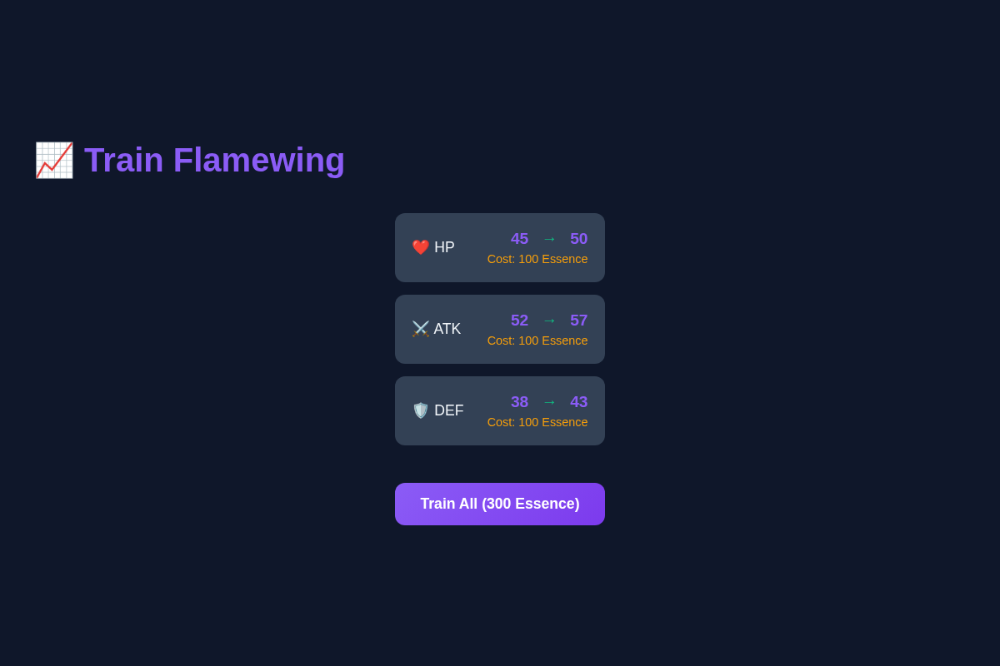
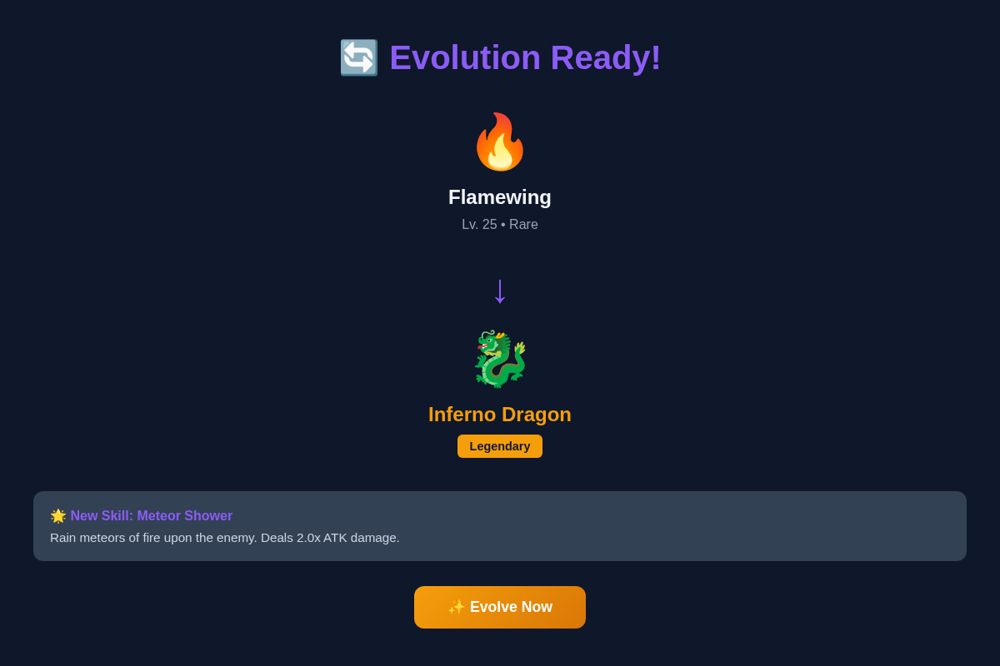

# MiMo Monster Breeder 🥚

AI-powered monster collection game. Hatch, train, battle, and evolve unique monsters generated by MiMo AI V2.5 Pro.

## Features

- **🥚 Hatch Monsters** — Generate unique monsters with AI-powered names, personalities, and skills
- **📊 Train & Level Up** — Spend essence to boost HP, ATK, and DEF stats
- **⚔️ Battle System** — 1v1 turn-based battles with AI-generated commentary
- **🔄 Evolution** — Evolve monsters at level 25 for new forms and powerful skills
- **💾 Local Storage** — All progress saved in browser localStorage

## Screenshots

### 1. Home - Hatch & Stats

Hatch new monsters, view your essence balance, and track battle statistics.

### 2. Collection - Your Monsters

Browse all your monsters with stats, rarity, and quick action buttons.

### 3. Battle - 1v1 Combat

Turn-based battles with real-time HP tracking and AI-generated commentary.

### 4. Training - Level Up Stats

Spend essence to increase HP, ATK, and DEF stats for your monsters.

### 5. Evolution - Unlock New Forms

Evolve monsters at level 25 to unlock new forms and powerful skills.

## Tech Stack

- **Frontend:** Next.js 14 + TypeScript + Tailwind CSS
- **State:** Zustand
- **AI:** MiMo AI V2.5 Pro (with local fallback)
- **Icons:** Lucide React
- **Deployment:** Netlify (static export)

## Live Deployment

**🌐 Live Site:** https://mimo-monster-breeder.netlify.app/

**Deployment Status:** ✅ Successfully deployed to Netlify (May 24, 2026)

**Features Live:**
- 🥚 Hatch AI-generated monsters
- 📊 Train & level up stats
- ⚔️ 1v1 turn-based battles
- 🔄 Evolution at level 25
- 💾 localStorage persistence

## MiMo AI V2.5 Pro Integration

**✅ Integration Status:** Successfully implemented

**AI-Powered Features:**
1. **Monster Generation** — Unique names, personalities, and skills
2. **Skill Generation** — New attack/defense skills for training/evolution
3. **Evolution Generation** — Lore-based evolution stories and new forms
4. **Battle Commentary** — Real-time AI-generated battle narration

**API Endpoints Implemented:**
- `POST /api/generate/monster` — Generate new monster with personality
- `POST /api/generate/skill` — Generate new skill for monster
- `POST /api/generate/evolution` — Generate evolution data at level 25
- `POST /api/generate/battle-commentary` — Generate real-time battle commentary

**Fallback System:** If MiMo API is unavailable, uses local generation with similar quality.

## Getting Started

### Prerequisites

- Node.js 18+
- npm or yarn

### Installation

```bash
# Clone repository
git clone https://github.com/YOUR_USERNAME/mimo-monster-breeder.git
cd mimo-monster-breeder

# Install dependencies
npm install

# Run development server
npm run dev
```

Open [http://localhost:3000](http://localhost:3000) to play.

### Build for Production

```bash
npm run build
```

Static files will be in `out/` directory.

## Project Structure

```
mimo-monster-breeder/
├── app/
│   ├── api/generate/          # AI generation endpoints
│   │   ├── monster/
│   │   ├── skill/
│   │   ├── evolution/
│   │   └── battle-commentary/
│   ├── collection/            # Monster collection page
│   ├── battle/                # Battle arena page
│   ├── training/              # Training grounds page
│   ├── layout.tsx             # Root layout
│   ├── page.tsx               # Home page
│   └── globals.css            # Global styles
├── components/
│   ├── ui/                    # UI components
│   │   ├── Button.tsx
│   │   └── MonsterCard.tsx
│   └── layout/                # Layout components
│       └── Navbar.tsx
├── lib/
│   ├── types.ts               # TypeScript types
│   ├── store.ts               # Zustand state management
│   └── api/
│       └── monster.ts         # Monster generation logic
├── public/                    # Static assets
├── PRD.md                     # Product requirements
└── DESIGN.md                  # Design system
```

## Gameplay

### 1. Hatch Egg
Click "Hatch Egg" to generate a new monster with:
- Random rarity (Common, Rare, Epic, Legendary)
- AI-generated name and personality
- Base stats scaled by rarity
- Starting skill

### 2. Train Monsters
Spend essence to increase stats:
- +5 HP/ATK/DEF per training session
- Cost: 100 essence per stat
- Max level: 50

### 3. Battle
Challenge random AI opponents:
- Turn-based combat
- Win: +essence, +XP
- Lose: +XP (half)
- AI-generated battle commentary

### 4. Evolution
At level 25, evolve your monster:
- New name and form
- +20% all stats
- Unlock powerful new skill
- One-time per monster

## Rarity System

| Rarity | HP | ATK | DEF | Drop Rate |
|--------|----|----|-----|-----------|
| Common | 30 | 35 | 30 | 60% |
| Rare | 45 | 52 | 38 | 25% |
| Epic | 60 | 68 | 50 | 12% |
| Legendary | 80 | 90 | 70 | 3% |

## API Endpoints

### POST /api/generate/monster
Generate new monster with personality and skills.

**Request:**
```json
{
  "rarity": "Rare"
}
```

**Response:**
```json
{
  "name": "Flamewing",
  "personality": "Fiery and bold, loves to charge headfirst into battle.",
  "baseStats": { "hp": 45, "atk": 52, "def": 38 },
  "startingSkill": {
    "name": "Flame Burst",
    "description": "A burst of flames that deals 1.2x ATK damage.",
    "modifier": 1.2
  },
  "type": "Fire"
}
```

### POST /api/generate/skill
Generate new skill for training/evolution.

### POST /api/generate/evolution
Generate evolution data at level 25.

### POST /api/generate/battle-commentary
Generate real-time battle commentary.

## Development

```bash
# Run dev server
npm run dev

# Build for production
npm run build

# Lint code
npm run lint
```

## Deployment

### Netlify

1. Push to GitHub
2. Connect repository to Netlify
3. Build settings:
   - Build command: `npm run build`
   - Publish directory: `out`
4. Deploy

### Environment Variables

Optional (for MiMo AI integration):

```env
MIMO_API_KEY=your_mimo_api_key_here
```

If not set, uses local fallback generation.

## License

MIT

## Credits

- Built with [Next.js](https://nextjs.org/)
- Icons by [Lucide](https://lucide.dev/)
- AI powered by MiMo AI V2.5 Pro
